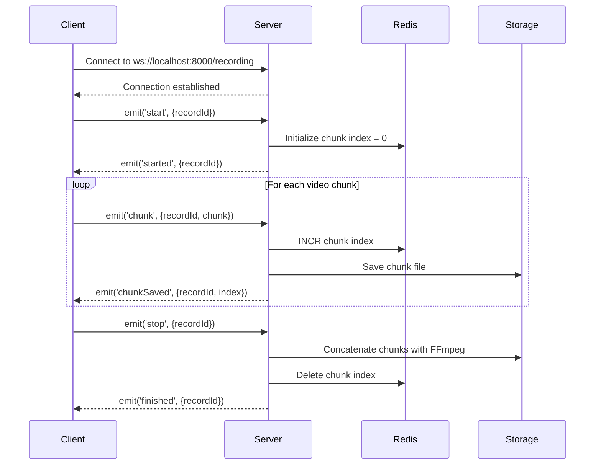

# WebSocket API Documentation

## Overview

The Screen Recorder Backend provides a WebSocket API for real-time screen recording functionality. This document describes the WebSocket events and data structures.

## Connection

**WebSocket URL:** `ws://localhost:8000/recording`

**Transport:** WebSocket only (no polling fallback)

**CORS:** Enabled for all origins in development

## Events

### Client → Server Events

#### 1. `start`

Initiates a new recording session.

**Payload:**
```typescript
{
  recordId: string;  // Unique identifier for the recording session
}
```

**Example:**
```javascript
socket.emit('start', { recordId: 'abc123' });
```

**Response:** Server emits `started` event (see below)

---

#### 2. `chunk`

Sends a video chunk to the server for processing.

**Payload:**
```typescript
{
  recordId: string;  // Recording session identifier
  chunk: Buffer;     // Video data chunk (WebM format)
}
```

**Example:**
```javascript
socket.emit('chunk', {
  recordId: 'abc123',
  chunk: videoDataBuffer
});
```

**Response:** Server emits `chunkSaved` event (see below)

---

#### 3. `stop`

Stops the recording session and triggers video finalization.

**Payload:**
```typescript
{
  recordId: string;  // Recording session identifier
}
```

**Example:**
```javascript
socket.emit('stop', { recordId: 'abc123' });
```

**Response:** Server emits `finished` event (see below)

---

### Server → Client Events

#### 1. `started`

Confirms that a recording session has been started.

**Payload:**
```typescript
{
  recordId: string;  // Recording session identifier
}
```

**Example:**
```javascript
socket.on('started', (data) => {
  console.log('Recording started:', data.recordId);
});
```

---

#### 2. `chunkSaved`

Confirms that a video chunk has been saved successfully.

**Payload:**
```typescript
{
  recordId: string;  // Recording session identifier
  index: number;     // Chunk index (0-based)
}
```

**Example:**
```javascript
socket.on('chunkSaved', (data) => {
  console.log(`Chunk ${data.index} saved for ${data.recordId}`);
});
```

---

#### 3. `finished`

Confirms that a recording session has been completed and finalized.

**Payload:**
```typescript
{
  recordId: string;  // Recording session identifier
}
```

**Example:**
```javascript
socket.on('finished', (data) => {
  console.log('Recording finished:', data.recordId);
  // You can now download the recording using the REST API
});
```

---

## Recording Workflow

### Complete Example

```javascript
// Connect to WebSocket
const socket = io('ws://localhost:8000/recording', {
  transports: ['websocket']
});

const recordId = generateUniqueId(); // e.g., UUID

// 1. Start recording
socket.emit('start', { recordId });

socket.on('started', (data) => {
  console.log('Recording started:', data.recordId);
  
  // 2. Send chunks
  mediaRecorder.ondataavailable = (event) => {
    if (event.data.size > 0) {
      socket.emit('chunk', {
        recordId,
        chunk: event.data
      });
    }
  };
  
  mediaRecorder.start(1000); // Capture chunks every 1 second
});

socket.on('chunkSaved', (data) => {
  console.log(`Chunk ${data.index} saved`);
  updateProgress(data.index);
});

// 3. Stop recording
function stopRecording() {
  mediaRecorder.stop();
  socket.emit('stop', { recordId });
}

socket.on('finished', (data) => {
  console.log('Recording complete:', data.recordId);
  
  // 4. Download the final video (REST API)
  window.location.href = `/recordings/download/${recordId}%2Ffinal.webm`;
});
```

---

## Technical Details

### State Management

- **Chunk Indices:** Managed via Redis for HA compatibility
- **Redis Key Format:** `recording:{recordId}:chunk_index`
- **Atomic Operations:** Redis INCR ensures thread-safe chunk numbering

### Storage

- **Format:** WebM (video/webm)
- **Chunks:** Stored as `{recordId}/chunk-{index}.webm`
- **Final Video:** Concatenated to `{recordId}/final.webm`
- **Processing:** Uses FFmpeg for video concatenation

### Error Handling

All errors are logged server-side. Clients should implement:
- Connection timeout handling
- Reconnection logic with exponential backoff
- Chunk retry mechanism for failed uploads

### Scalability

- **Load Balancing:** Compatible with multiple instances
- **Session Persistence:** Not required (stateless via Redis)
- **Sticky Sessions:** Not needed

---

## REST API Integration

After recording is complete, use the REST API to:

### Check Recording Status

```bash
GET /recordings/:recordId/status
```

**Response:**
```json
{
  "recordId": "abc123",
  "status": "ready",
  "downloadUrl": "/recordings/download/abc123%2Ffinal.webm"
}
```

### Download Recording

```bash
GET /recordings/download/:key
```

Downloads the final video file.

---

## Best Practices

1. **Unique Record IDs:** Always generate unique IDs (UUID recommended)
2. **Chunk Size:** Keep chunks small (1-2 seconds of video)
3. **Error Handling:** Always listen for connection errors
4. **Cleanup:** Always call `stop` to finalize recordings
5. **Progress Tracking:** Use `chunkSaved` events for progress bars

---

## Connection Lifecycle



---

## Environment Variables

```env
# WebSocket Port
WEBSOCKET_PORT=8000

# Redis Configuration (for chunk index management)
REDIS_HOST=localhost
REDIS_PORT=6379
```

---

## Troubleshooting

### Connection Issues

**Problem:** Cannot connect to WebSocket  
**Solution:** Ensure port 8000 is not blocked by firewall

### Chunks Not Saving

**Problem:** `chunkSaved` events not received  
**Solution:** Check Redis connection and storage permissions

### Video Not Finalizing

**Problem:** `finished` event not received after `stop`  
**Solution:** Ensure FFmpeg is installed and accessible

---

## API Versioning

Current Version: **1.0**

Breaking changes will be announced in advance with migration guides.
